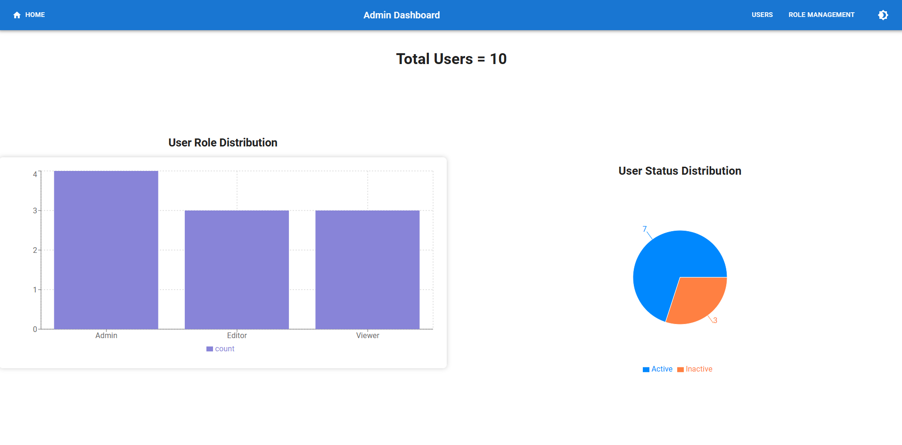
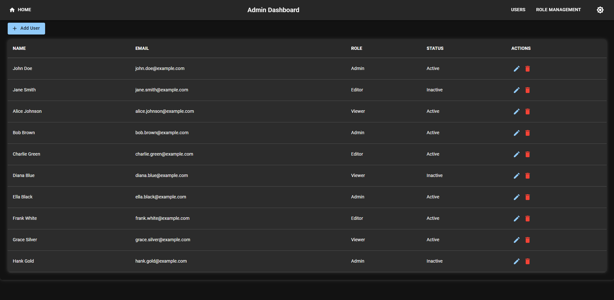
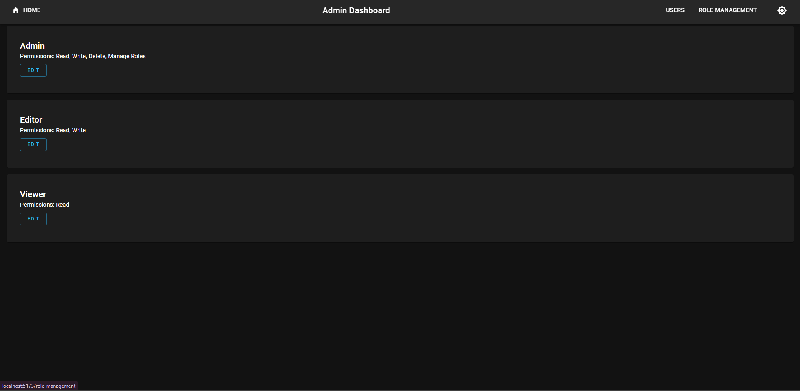
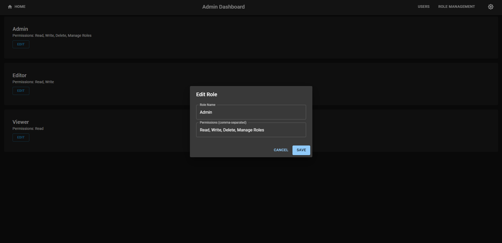
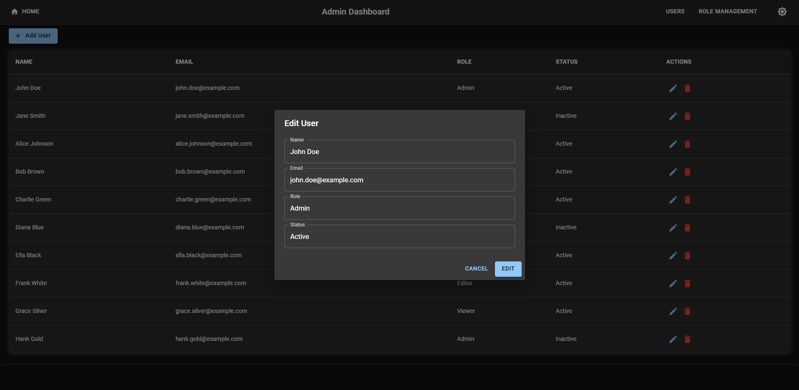
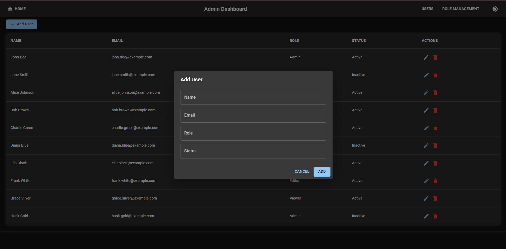

# RBAC Admin (Frontend)

RBAC Admin is a **frontend-only** application built to manage user roles and permissions within a web application using **React** and modern frontend technologies. This project demonstrates a role-based access control (RBAC) system where users are categorized into different roles like Admin, Editor, and Viewer, and their respective permissions are visualized through charts.

## Features

- **User Management UI**: View and manage users, including their roles and statuses.
- **Role Management**: Assign and modify user roles (Admin, Editor, Viewer).
- **Permissions**: Visualize permissions and user role distributions.
- **User Dashboard**: Overview of the system’s users, roles, and statuses.
- **Charts**: Data visualizations for user role distribution and user statuses.
- **Responsive Design**: Optimized for both desktop and mobile viewing.

## Technologies Used

- **Frontend**: React, Material-UI (MUI)
- **Styling**: Material UI
- **Charting**: Recharts for data visualization (User Role Distribution, User Status, etc.)

## Getting Started

To run this project locally, follow these steps:

### Prerequisites

Make sure you have the following installed:

- **Node.js** (v16.x or higher)
- **npm** or **yarn** (to manage dependencies)

### Installation

1. Clone the repository:

   ```bash
   git clone https://github.com/vasu5x2/RBAC-admin.git

   ## Screenshots
 ### Home 

### User 


###Role Distribution


### Feature 4


### Feature 5


### Feature 6

